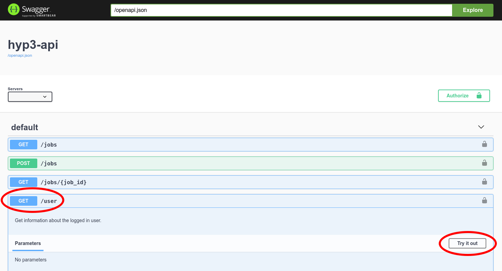
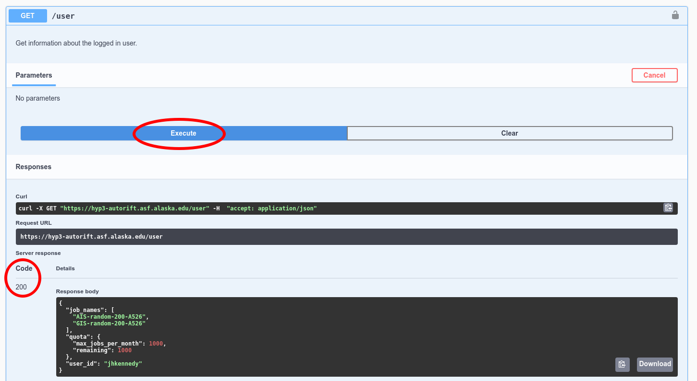
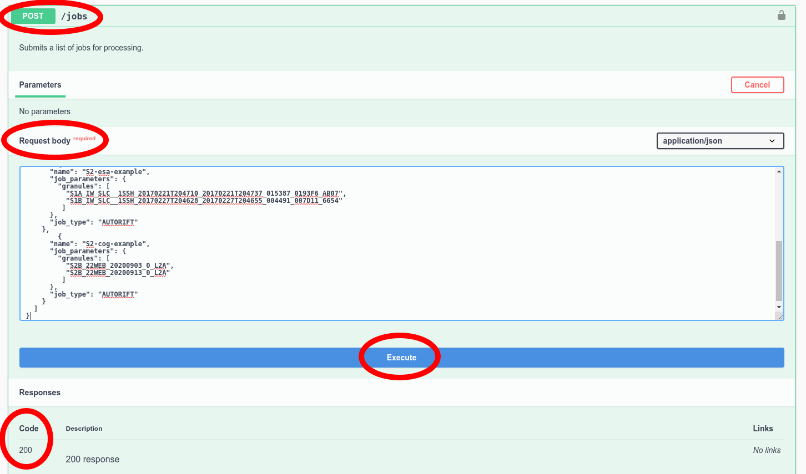
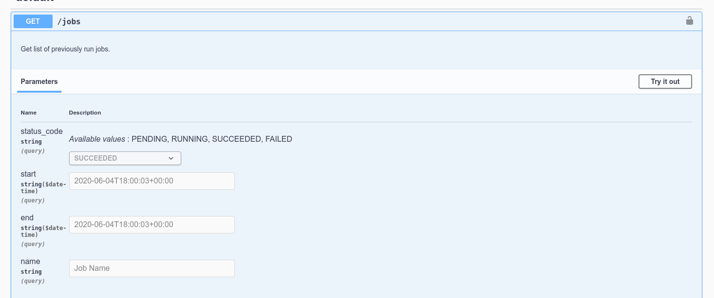

# Using the HyP3 API for autoRIFT

AutoRIFT's HyP3 API is built on [OpenAPI](https://www.openapis.org/) and 
[Swagger](https://swagger.io/) and available at:

https://hyp3-autorift.asf.alaska.edu/ui

In order to use the API, you'll need a `asf-urs` session cookie, which you can get
by [signing in to Vertex](https://search.asf.alaska.edu/#/)


### Confirm you are authenticated

To confirm you are authenticated, you can run a `GET` request to our `/user` endpoint.
Select the blue `GET` button next to `/user` and click the `Try it out` button


Then, execute the request and look at the response


If you get a `Code 200` you should see a JSON dictionary of your user information.
If you get a `Code 401` you are not currently authenticated.

## Submitting jobs

Jobs are submitted through the API by providing a JSON payload with a list of job
definitions. A minimal job list for a single Sentinel-1 autoRIFT job would look like:

```json
{
  "jobs": [
    {
      "job_type": "AUTORIFT",
      "name": "s1-example",
      "job_parameters": {
        "granules": [
          "S1A_IW_SLC__1SSH_20170221T204710_20170221T204737_015387_0193F6_AB07",
          "S1B_IW_SLC__1SSH_20170227T204628_20170227T204655_004491_007D11_6654"
        ]
      }
    }
  ]
}
```

The job list may contain up to 200 job definitions.

### Sentinel-1, Sentinel-2, and (soon!) Landsat-8

For each supported satellite mission, the granule (scene) pairs to process are
provided by ID:
* Sentinel-1: [ESA granule ID](https://sentinel.esa.int/web/sentinel/user-guides/sentinel-1-sar/naming-conventions)
* Sentinel-2: [ESA granule ID](https://sentinel.esa.int/web/sentinel/user-guides/sentinel-2-msi/naming-convention) 
  *or* [Element 84 Earth Search ID](https://registry.opendata.aws/sentinel-2/)
* Landsat-8 Collection 2: [USGS scene ID](https://www.usgs.gov/faqs/what-naming-convention-landsat-collection-2-level-1-and-level-2-scenes?qt-news_science_products=0#qt-news_science_products)

To submit an example set of jobs including all supported missions, you could write a job list like:

```json
{
  "jobs": [
    {
      "name": "s1-example",
      "job_parameters": {
        "granules": [
          "S1A_IW_SLC__1SSH_20170221T204710_20170221T204737_015387_0193F6_AB07",
          "S1B_IW_SLC__1SSH_20170227T204628_20170227T204655_004491_007D11_6654"
        ]
      },
      "job_type": "AUTORIFT"
    },
    {
      "name": "s2-esa-example",
      "job_parameters": {
        "granules": [
          "S2B_MSIL1C_20200612T150759_N0209_R025_T22WEB_20200612T184700",
          "S2A_MSIL1C_20200627T150921_N0209_R025_T22WEB_20200627T170912"
        ]
      },
      "job_type": "AUTORIFT"
    },
    {
      "name": "s2-cog-example",
      "job_parameters": {
        "granules": [
          "S2B_22WEB_20200612_0_L1C",
          "S2A_22WEB_20200627_0_L1C"
        ]
      },
      "job_type": "AUTORIFT"
    }
    {
      "name": "l8-example",
      "job_parameters": {
        "granules": [
          "LC08_L1TP_009011_20200703_20200913_02_T1",
          "LC08_L1TP_009011_20200820_20200905_02_T1"
        ]
      },
      "job_type": "AUTORIFT"
    }
  ]
}
```

With your JSON jobs definition, you can `POST` to the `/jobs` endpoint to
submit the jobs. 

1. click the green `POST` button next to `/jobs`
2. click `Try it out` on the right
3. paste your jobs definition into the `Request body`
4. click `execute`



If your jobs were submitted successfully you should see a `Code 200` response and
JSON response of your job list, with some additional job attributes filled in.

## Querying jobs

You can `GET` job information from the `/jobs` endpoint. You may provide query
parameters to filter jobs which jobs are returned:


For our above examples, you can get the job that was submitted with Sentinel-2 COG IDs by
searching for `name=s2-cog-example`. If you provide *no* query parameters, you'll get a
JSON response with a jobs list for every job you've submitted. 

Within the jobs list, a complete job dictionary will look like:
```JSON
{
  "browse_images": [
    "https://hyp3-autorift-contentbucket-102baltr3ibfm.s3.us-west-2.amazonaws.com/0c8d6dfc-a909-43b7-ae80-b1ee6acff9e7/S1BA_20170112T090955_20170118T091036_HHP007_VEL240_A_2CB6.png"
  ],
  "expiration_time": "2021-04-27T00:00:00+00:00",
  "files": [
    {
      "filename": "S1BA_20170112T090955_20170118T091036_HHP007_VEL240_A_2CB6.nc",
      "size": 6574604,
      "url": "https://hyp3-autorift-contentbucket-102baltr3ibfm.s3.us-west-2.amazonaws.com/0c8d6dfc-a909-43b7-ae80-b1ee6acff9e7/S1BA_20170112T090955_20170118T091036_HHP007_VEL240_A_2CB6.nc"
    }
  ],
  "job_id": "0c8d6dfc-a909-43b7-ae80-b1ee6acff9e7",
  "job_parameters": {
    "granules": [
      "S1A_IW_SLC__1SSH_20170118T091036_20170118T091104_014884_01846D_01C5",
      "S1B_IW_SLC__1SSH_20170112T090955_20170112T091023_003813_0068DC_C750"
    ]
  },
  "job_type": "AUTORIFT",
  "name": "GIS-random-200-A526",
  "request_time": "2020-10-28T00:55:35+00:00",
  "status_code": "SUCCEEDED",
  "thumbnail_images": [
    "https://hyp3-autorift-contentbucket-102baltr3ibfm.s3.us-west-2.amazonaws.com/0c8d6dfc-a909-43b7-ae80-b1ee6acff9e7/S1BA_20170112T090955_20170118T091036_HHP007_VEL240_A_2CB6_thumb.png"
  ],
  "user_id": "MY_EDL_USERNAME"
}
```

Importantly, the `files` block provides download links for the product files. 